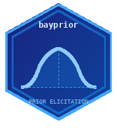

<p align="center">
  
  <h1 align="center">
    bayprior: Bayesian Prior Elicitation for Clinical Trials
    <br>
    <a href="https://www.r-project.org/">
      
    </a>
    <a href="https://shiny.posit.co/">
      
    </a>
    <a href="https://thinkr-open.github.io/golem/">
      
    </a>
    <a href="https://www.gnu.org/licenses/gpl-3.0">
      
    </a>
    <a href="https://github.com/ndohpenngit/bayprior/actions">
      
    </a>
    <a href="https://rstudio.github.io/renv/">
      
    </a>
    <a href="https://lifecycle.r-lib.org/articles/stages.html#experimental">
      
    </a>
  </h1>
</p>

---

## 🧭 Overview

**bayprior** is an advanced interactive **R package and Shiny application** designed for Biostatisticians and Clinical Researchers to implement **Bayesian Prior Elicitation, Conflict Diagnostics, and Sensitivity Analysis** for clinical trials.

The package addresses the upstream problem that existing Bayesian trial packages (`trialr`, `RBesT`, `hdbayes`) largely ignore: *how do you construct, validate, and justify your prior to a regulator?* The FDA's 2026 draft guidance on Bayesian methods makes this a live, urgent need — with no unified R tool previously addressing it.

This toolkit enables users to:

- **Elicit structured priors:** Implement SHELF-style quantile matching, moment matching, and the interactive roulette method across Beta, Normal, Gamma, and Log-Normal families.
- **Aggregate expert opinions:** Pool beliefs from multiple experts via linear or logarithmic opinion pooling with pairwise Bhattacharyya agreement diagnostics.
- **Diagnose prior-data conflict:** Compute Box's p-value, surprise index, Bhattacharyya overlap, and multivariate Mahalanobis distance.
- **Quantify sensitivity:** Evaluate how posterior conclusions shift across hyperparameter grids via tornado and influence heatmap plots.
- **Build robust priors:** Construct sceptical, robust mixture, and calibrated power priors for regulatory sensitivity analyses.
- **Generate regulatory reports:** Produce structured HTML/PDF prior justification reports aligned with FDA/EMA submission expectations.

---

## 🚀 Features & Modules

| Module | Detail | Primary Output | Goal |
|---|---|---|---|
| **Prior Elicitation** | Quantile matching, moment matching, SHELF roulette for Beta/Normal/Gamma/Log-Normal | Fitted density plot + parameter table | Structured expert prior elicitation |
| **Expert Pooling** | Linear and logarithmic opinion pooling across multiple experts | Consensus density overlay + Bhattacharyya matrix | Aggregate multi-expert beliefs |
| **Conflict Diagnostics** | Box p-value, surprise index, KL divergence, overlap coefficient | Prior–Likelihood–Posterior overlay | Detect prior misspecification |
| **Mahalanobis Check** | Two-endpoint multivariate conflict test | Chi-sq p-value + per-parameter z-scores | Two-endpoint trials |
| **Sensitivity Analysis** | Hyperparameter grid over posterior mean, SD, CrI, Pr(efficacy) | Tornado plot + influence heatmap | Demonstrate robustness to regulators |
| **Sceptical Prior** | Spiegelhalter–Freedman centred-at-null prior | Prior density + summary statistics | Conservative regulatory sensitivity |
| **Robust Mixture** | Schmidli et al. MAP robust mixture prior | Robust vs informative density overlay | Protection against misspecification |
| **Power Prior** | Ibrahim–Chen calibrated borrowing weight via Bayes Factor | Calibration curves + optimal δ | Principled historical data borrowing |
| **Export Report** | HTML/PDF prior justification document | Regulatory-ready report | FDA/EMA submission documentation |

---

## 🔬 Core Methodology

### 🧠 Prior Elicitation

The package implements three structured elicitation approaches. **Quantile matching** fits a parametric distribution to expert-specified probability–value pairs using numerical optimisation. **Moment matching** derives parameters analytically from an expert-supplied mean and standard deviation. The **SHELF roulette method** (Oakley & O'Hagan, 2010) presents the expert with a histogram grid where they allocate chips across bins; the resulting distribution is fitted to the chip allocation in real time.

All methods support four distribution families:

- **Beta** — response rates, proportions, probabilities ∈ (0, 1)
- **Normal** — unbounded continuous quantities (e.g. mean differences)
- **Gamma** — positive quantities (e.g. rates, variances)
- **Log-Normal** — ratios and positive skewed quantities (e.g. hazard ratios)

### ⚖️ Prior-Data Conflict Diagnostics

Conflict detection follows Box (1980). The **prior predictive p-value** tests whether the observed data is plausible under the prior predictive distribution. The **surprise index** measures standardised distance between the prior mean and observed data. The **Bhattacharyya overlap coefficient** quantifies distributional overlap between the prior and the (normalised) likelihood. For two-endpoint trials, a **Mahalanobis distance** provides an omnibus multivariate conflict statistic with a chi-squared reference distribution.

### 🔄 Sensitivity Analysis

The sensitivity module evaluates how key posterior quantities — posterior mean, posterior SD, CrI width, and Pr(θ > θ₀) — change as prior hyperparameters vary over a user-specified grid. Results are visualised as **tornado plots** (bar width = range of influence, ordered from most to least sensitive) and **influence heatmaps** (two-dimensional colour-coded grid). The reference prior is marked on all plots.

### 🛡️ Robust and Power Priors

The **robust mixture prior** (Schmidli et al., 2014) mixes the informative elicited prior with a vague component, protecting against prior-data conflict. The **sceptical prior** (Spiegelhalter & Freedman, 1994) is centred at the null value of the treatment effect and calibrated to weak, moderate, or strong scepticism. The **power prior** (Ibrahim & Chen, 2000) down-weights historical data by a factor δ ∈ (0, 1) calibrated to achieve a target Bayes Factor.

---

## 🖥️ User Interface

### 🔹 Prior Elicitation Panel

Users configure and fit their prior here:

- **Distribution family:** Select Beta, Normal, Gamma, or Log-Normal
- **Elicitation method:** Toggle between quantile matching, moment matching, or the interactive roulette chip grid
- **Real-time density preview:** Prior density updates instantly as parameters are adjusted
- **Expert pool:** Add multiple fitted priors to a pool for consensus aggregation
- **Value boxes:** Prior mean, SD, and 95% CrI displayed at a glance

### 🔹 Conflict Diagnostics Panel

- **Data entry:** Binary (events/n) or continuous (mean, SD, n) observed data
- **Diagnostic statistics:** Box p-value, surprise index, and overlap coefficient displayed as value boxes with colour-coded severity (green = no conflict, red = severe)
- **Overlay plot:** Interactive Prior–Likelihood–Posterior density overlay via Plotly
- **Plain-language recommendation:** Automatic severity classification (`none` / `mild` / `severe`) with actionable guidance

### 🔹 Sensitivity Analysis Panel

- **Hyperparameter grid:** User-defined ranges for each prior parameter with adjustable grid resolution
- **Target outcomes:** Select any combination of posterior mean, SD, CrI width, and Pr(efficacy)
- **Tornado plot:** Influence ordered from largest to smallest
- **Influence heatmap:** Two-dimensional colour map across the full parameter grid

### 🔹 Report Export Panel

- **Trial metadata:** Protocol number, indication, sponsor, statistician, date
- **Contents checklist:** Live status indicators showing which sections are complete
- **Output format:** HTML (self-contained) or PDF
- **Download:** Single click renders and downloads the report via `rmarkdown::render()`

---

## 📦 Installation

```r
# Development version from GitHub
# install.packages("devtools")
devtools::install_github("ndohpenngit/bayprior")
```

### Reproducible environment (renv)

This project uses [renv](https://rstudio.github.io/renv/) for reproducible package management. After cloning:

```r
renv::restore()   # installs exact package versions from renv.lock
```

---

## ⚡ Quick Start

```r
library(bayprior)

# 1. Fit a Beta prior via moment matching
prior <- elicit_beta(
  mean      = 0.35,
  sd        = 0.10,
  method    = "moments",
  label     = "Response rate (treatment arm)",
  expert_id = "Expert_1"
)
plot(prior)

# 2. Pool two experts
e1  <- elicit_beta(mean = 0.30, sd = 0.10, method = "moments", expert_id = "E1")
e2  <- elicit_beta(mean = 0.42, sd = 0.12, method = "moments", expert_id = "E2")
agg <- aggregate_experts(list(E1 = e1, E2 = e2), weights = c(0.6, 0.4))

# 3. Check for prior-data conflict
cd <- prior_conflict(prior, list(type = "binary", x = 18, n = 40))
print(cd)

# 4. Sensitivity analysis
sa <- sensitivity_grid(
  prior,
  data_summary = list(type = "binary", x = 18, n = 40),
  param_grid   = list(alpha = seq(1, 8, 0.5), beta = seq(2, 20, 1))
)
plot_tornado(sa)

# 5. Build a robust prior
rob <- robust_prior(prior, vague_weight = 0.20)

# 6. Generate regulatory report
prior_report(
  prior       = prior,
  conflict    = cd,
  sensitivity = sa,
  trial_name  = "TRIAL-001",
  sponsor     = "Example Pharma Ltd",
  author      = "N.P., Principal Biostatistician"
)

# 7. Launch the full Shiny app
run_app()
```
---

## 📚 References

- O'Hagan, A. et al. (2006). *Uncertain Judgements: Eliciting Experts' Probabilities*. Wiley.
- Box, G. E. P. (1980). Sampling and Bayes' inference in scientific modelling and robustness. *JRSS-A*, 143, 383–430.
- Oakley, J. E. & O'Hagan, A. (2010). *SHELF: the Sheffield Elicitation Framework*. University of Sheffield.
- Schmidli, H. et al. (2014). Robust meta-analytic-predictive priors in clinical trials with historical control information. *Biometrics*, 70, 1023–1032.
- Ibrahim, J. G. & Chen, M.-H. (2000). Power prior distributions for regression models. *Statistical Science*, 15, 46–60.
- Spiegelhalter, D. J. & Freedman, L. S. (1994). Bayesian approaches to clinical trials. *JRSS-A*, 157, 357–416.
- FDA (2026). *Draft Guidance: Bayesian Statistical Methods for Drug and Biological Products*.

---

## 📝 Citation

```bibtex
@Manual{bayprior2025,
  title  = {bayprior: Bayesian Prior Elicitation, Conflict Diagnostics and
             Sensitivity Analysis for Clinical Trials},
  author = {Ndoh Penn},
  year   = {2025},
  note   = {R package version 0.1.0},
  url    = {https://github.com/ndohpenngit/bayprior}
}
```

---

## ⚖️ License

GPL (>= 3) — see [LICENSE](LICENSE) for details.
